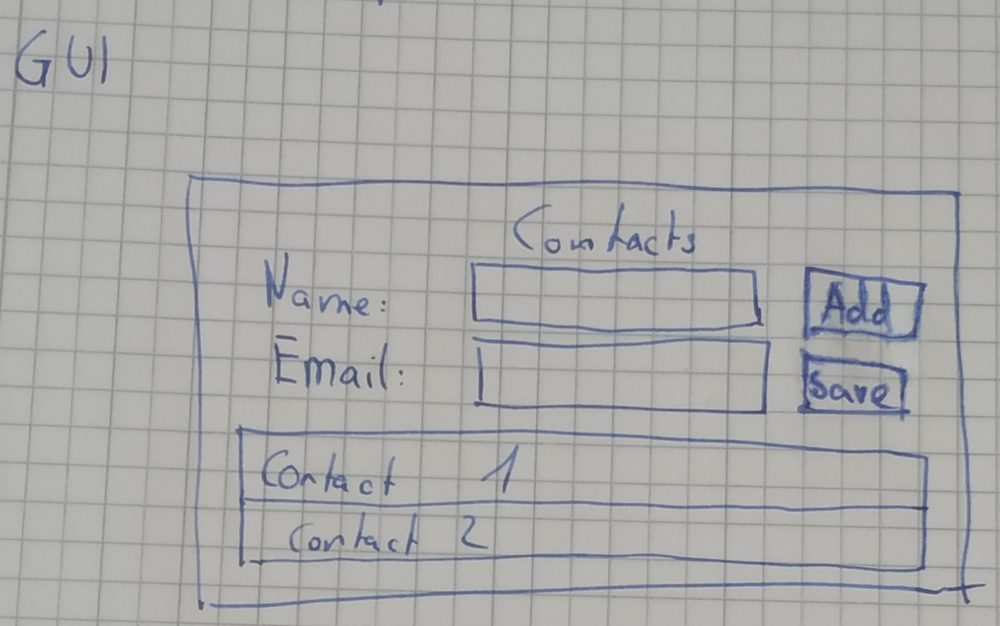

# SYP App - Contacts

Die App soll dazu dienen, dass Kontakte verwaltet werden können.

## Startup

At Startup sollen bereits vorhandene Kontakte aus einer Datei ("contacts.json") geladen werden. Falls diese nicht vorhanden ist (= Exception) soll sie erstellt werden & mit einem leeren Array beschrieben werden.

## GUI

Die App soll wie folgt aussehen:




Hiebei sollen folgende User-Stories unterstützt werden:

* Kontakte können, nachdem Daten in den jeweiligen Inputs eingegeben wurden, dem Kontaktbuch durch einen Klick auf "Add" hinzugefügt werden
* Bei einem Klick auf Save bzw. beim Verlassen der Anwendung werden die Kontakte in das anfänglich erwähnte File gespeichert
* In der Liste unter den Inputs werden alle momentanen Kontakte angezeigt
  * Nachdem einer / mehrere Kontakte auswewählt wurde(n), können diese über das Kontextmenu entfernt werden.

## CLI

Die Anwendung soll ebenfalls über die CLI bedient werden können. Hierbei soll @Startup folgendes Menu erscheinen:

```
Welcome to the Contact Book!
Please choose one of the options below:
a ) View all Contacts
b ) Add new contact
c ) Remove contact
d ) Save contacts
e) Exit
Your choice: 
```

### Kontakte anzeigen

```
Your contacts:
0. Martin Linhard - linmad17@htl-kaindorf.at
1. Elias Trummer - trueld17@htl-kaindorf.at
```

### Kontakt hinzufügen

```
Add a new contact:
Name: {NAME}
Email: {EMAIL}
--> Contact Martin Linhard (linmad17@htl-kaindorf.at) has been added successfully.
```

### Kontakt(e) löschen

```
Remove contacts:
Add number of contacts to be removed (seperate with ", "): 1, 2
```

### Kontakte speichern

```
All contacts have been saved successfully.
```

